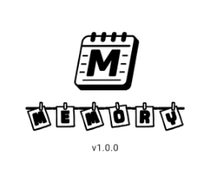
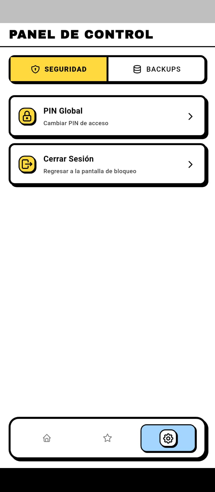
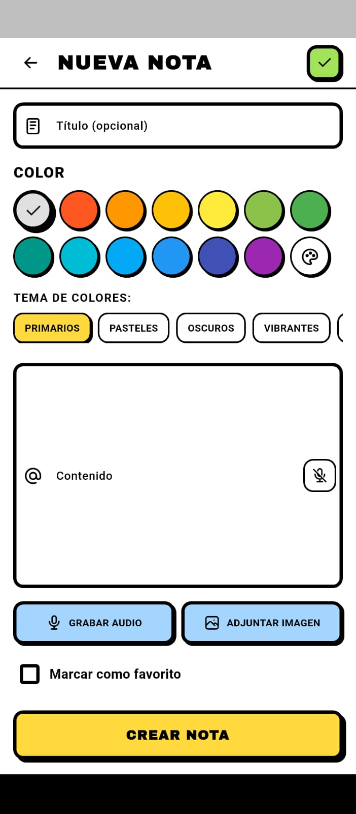
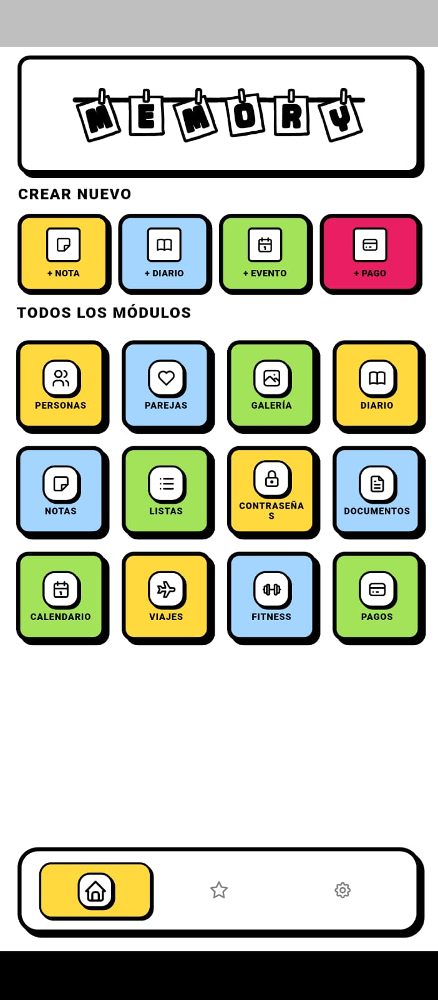
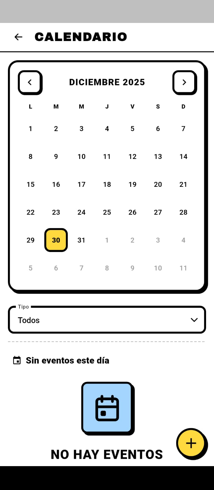
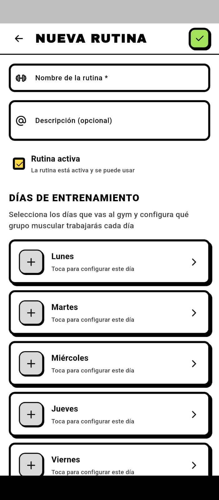
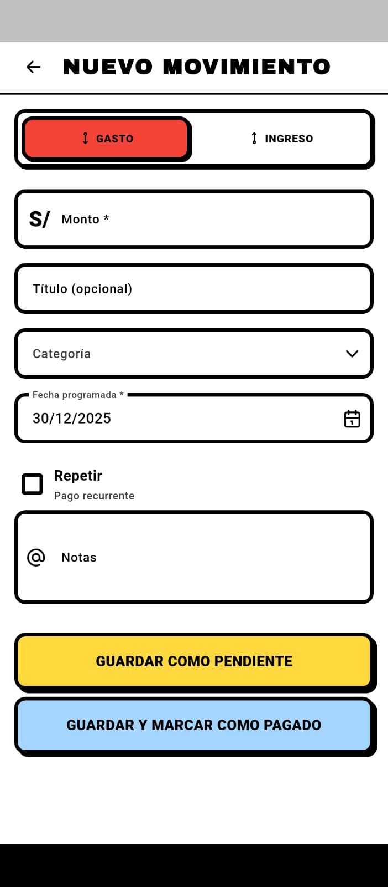

<div align="center">

# 🧠 MEMORY

### App de Gestión Personal




<br>

[](https://github.com/BryanRF/memory-pub)
[](https://flutter.dev)
[](LICENSE)

<br>

**Aplicación multiplataforma privada y segura con cifrado AES-256 y autenticación biométrica**

<br>

[](https://dart.dev/null-safety)
[](https://blog.cleancoder.com/uncle-bob/2012/08/13/the-clean-architecture.html)
[](https://github.com/BryanRF/memory-pub/releases/latest)

---

</div>

## 📋 Descripción

**MEMORY** es una aplicación multiplataforma desarrollada con Flutter que ofrece una solución completa para la gestión personal de información sensible. Diseñada con un enfoque en la privacidad y seguridad, utiliza cifrado **AES-256** de grado militar y autenticación biométrica para proteger tus datos más importantes.

La aplicación está construida siguiendo los principios de **Clean Architecture**, garantizando código mantenible, escalable y testeable.

---

## 📥 Descarga

<div align="center">

### ⬇️ Descargar APK desde Releases

<br>

[](https://github.com/BryanRF/memory-pub/releases/latest)
[](https://github.com/BryanRF/memory-pub/releases/latest)

<br>

**Versión:** `v1.0.0` | **Plataforma:** `Android` | **Estado:** `🚧 En Desarrollo`

<br>

[📦 Ver todas las Releases](https://github.com/BryanRF/memory-pub/releases)

</div>

### 🔧 Instalación del APK

**Opción 1: Desde GitHub Releases (Recomendado)**
1. Ve a la página de [Releases](https://github.com/BryanRF/memory-pub/releases/latest)
2. Descarga el archivo `memory-app.apk` desde la última release
3. Una vez descargado, abre el archivo en tu dispositivo Android

**Opción 2: Descarga Directa**
- Haz clic en el botón de descarga arriba para ir a la última release
- Descarga el archivo `memory-app.apk`
- Transfiere el archivo a tu dispositivo Android si lo descargaste en otro dispositivo

**Pasos de Instalación:**
1. Abre el archivo APK en tu dispositivo Android
2. Permite la instalación desde fuentes desconocidas si se solicita
3. Sigue las instrucciones de instalación
4. ¡Listo! Ya puedes usar MEMORY

### ⚙️ Primera Configuración

1. Abre la aplicación **MEMORY**
2. Configura tu autenticación biométrica cuando se solicite
3. Establece una contraseña maestra (si es requerida)
4. ¡Comienza a usar la aplicación!

---

## ✨ Características Principales

### 🔐 Seguridad y Privacidad

<div align="center">

| 🔒 Característica | 📝 Descripción |
|:-----------------:|:---------------|
| **Cifrado AES-256** | Todos los datos se cifran con el algoritmo AES-256 de grado militar |
| **Autenticación Biométrica** | Acceso seguro mediante huella dactilar o reconocimiento facial |
| **Almacenamiento Local** | Tus datos permanecen exclusivamente en tu dispositivo |
| **100% Offline** | Funciona completamente sin conexión a internet |

</div>

### 🏗️ Arquitectura y Rendimiento

<div align="center">

| ⚡ Característica | 🎯 Beneficio |
|:-----------------:|:-------------|
| **Clean Architecture** | Separación clara de responsabilidades en 3 capas |
| **Repository Pattern** | Abstracción de fuentes de datos |
| **Event-Driven** | Arquitectura basada en eventos para mejor escalabilidad |
| **Offline-First** | Funcionalidad completa sin conexión a internet |
| **Paginación Infinita** | Carga eficiente de grandes volúmenes de datos |

</div>

### 📱 Funcionalidades

- ✅ **15+ Módulos**: Amplia gama de funcionalidades para gestión personal
- ✅ **Backup Automático**: Respaldo automático de tus datos
- ✅ **100% Null-Safe**: Código completamente seguro con null safety
- ✅ **Interfaz Moderna**: UI/UX intuitiva y responsive

---

## 🛠️ Stack Tecnológico

<div align="center">

### Framework y Lenguaje

[](https://flutter.dev)
[](https://dart.dev)

### Gestión de Estado

[](https://riverpod.dev)

### Base de Datos

[](https://www.sqlite.org/)

### Seguridad

[](https://pub.dev/packages/local_auth)
[](https://en.wikipedia.org/wiki/Advanced_Encryption_Standard)

</div>

---

## 📸 Capturas de Pantalla

<div align="center">

| | | |
|:-------------------------:|:-------------------------:|:-------------------------:|
||||
|**📱 Pantalla Principal**|**🔐 Módulo de Seguridad**|**💾 Gestión de Datos**|
||||
|**🎨 Interfaz Moderna**|**🧭 Navegación Intuitiva**|**⚡ Funcionalidades Avanzadas**|
||||
|**⚙️ Configuración**|**🎯 Personalización**|**🚀 Más Características**|

</div>

---

## 🏛️ Arquitectura

La aplicación sigue los principios de **Clean Architecture**, organizando el código en tres capas principales:

```
┌─────────────────────────────────────────┐
│      Presentation Layer                 │
│  (UI, Widgets, State Management)       │
│  ┌───────────────────────────────────┐  │
│  │  • Widgets                         │  │
│  │  • State Management (Riverpod)     │  │
│  │  • UI Logic                        │  │
│  └───────────────────────────────────┘  │
└─────────────────────────────────────────┘
                    ↕
┌─────────────────────────────────────────┐
│        Domain Layer                      │
│  (Entities, Use Cases, Interfaces)      │
│  ┌───────────────────────────────────┐  │
│  │  • Entities                        │  │
│  │  • Use Cases                       │  │
│  │  • Repository Interfaces           │  │
│  └───────────────────────────────────┘  │
└─────────────────────────────────────────┘
                    ↕
┌─────────────────────────────────────────┐
│         Data Layer                       │
│  (Repositories, Data Sources, API)      │
│  ┌───────────────────────────────────┐  │
│  │  • Repositories                    │  │
│  │  • Data Sources (SQLite)           │  │
│  │  • API Clients                     │  │
│  └───────────────────────────────────┘  │
└─────────────────────────────────────────┘
```

### 🎯 Principios Aplicados

<div align="center">

| 🎯 Principio | 📋 Descripción |
|:------------:|:---------------|
| **🔀 Separación de Responsabilidades** | Cada capa tiene una responsabilidad única y bien definida |
| **🔌 Independencia de Frameworks** | La lógica de negocio no depende de Flutter |
| **🧪 Testabilidad** | Fácil de testear gracias a la inyección de dependencias |
| **🎨 Independencia de UI** | La UI puede cambiar sin afectar la lógica de negocio |
| **💾 Independencia de Base de Datos** | El almacenamiento puede cambiar sin afectar otras capas |

</div>

---

## 🔒 Seguridad

### 🔐 Cifrado

- ✅ Todos los datos sensibles se cifran usando **AES-256** antes de almacenarse
- ✅ Las claves de cifrado se gestionan de forma segura
- ✅ No se almacenan datos en texto plano

### 👤 Autenticación

- ✅ **Autenticación Biométrica**: Utiliza las capacidades nativas del dispositivo
- ✅ **Contraseña Maestra**: Opción adicional de seguridad
- ✅ **Sesiones Seguras**: Gestión segura de sesiones de usuario

### 🛡️ Privacidad

- ✅ **Sin Telemetría**: No se recopilan datos de uso
- ✅ **Sin Servidores Externos**: Todo funciona localmente
- ✅ **Control Total**: Tú tienes control completo sobre tus datos

---

## 📚 Módulos Disponibles

La aplicación incluye más de **15 módulos** para diferentes necesidades de gestión personal:

<div align="center">

| 📦 Módulo | 📝 Descripción |
|:---------:|:---------------|
| 🔑 **Contraseñas** | Gestión segura de contraseñas |
| 📝 **Notas** | Notas seguras y cifradas |
| 📄 **Documentos** | Documentos cifrados |
| 👥 **Contactos** | Contactos privados |
| 📅 **Calendario** | Calendario personal |
| ✅ **Tareas** | Tareas y recordatorios |
| 🔐 **Más módulos...** | Y muchos más en desarrollo |

</div>

---

## 🚀 Características Técnicas

### ⚡ Rendimiento

- 🚀 **Carga Rápida**: Optimizado para tiempos de inicio mínimos
- 📄 **Paginación Infinita**: Manejo eficiente de grandes listas
- 💾 **Caché Inteligente**: Sistema de caché para mejor rendimiento

### 🛡️ Confiabilidad

- 🌐 **Offline-First**: Funciona sin conexión a internet
- 💾 **Backup Automático**: Respaldo automático de datos
- 🔄 **Recuperación de Datos**: Sistema robusto de recuperación

### ✨ Calidad de Código

- ✅ **100% Null-Safe**: Código completamente seguro
- 🧹 **Clean Code**: Código limpio y mantenible
- 🏗️ **SOLID Principles**: Principios SOLID aplicados
- 🎨 **Design Patterns**: Uso de patrones de diseño apropiados

---

## 📄 Licencia

Esta aplicación es **privada** y su código fuente no está disponible públicamente.

---

## 🤝 Contribuciones

Esta es una aplicación privada. Las contribuciones no están abiertas al público.

---

## 📞 Soporte

Para soporte o consultas sobre la aplicación, por favor contacta al desarrollador.

---

<div align="center">

### ⚠️ Estado del Proyecto

**🚧 Esta aplicación se encuentra actualmente en desarrollo activo.**

Las características, funcionalidades y la interfaz pueden cambiar en futuras versiones.

---

**Desarrollado con ❤️ usando Flutter**

[](https://flutter.dev)

[](https://github.com/BryanRF/memory-pub)
[](https://github.com/BryanRF/memory-pub/releases)

</div>
